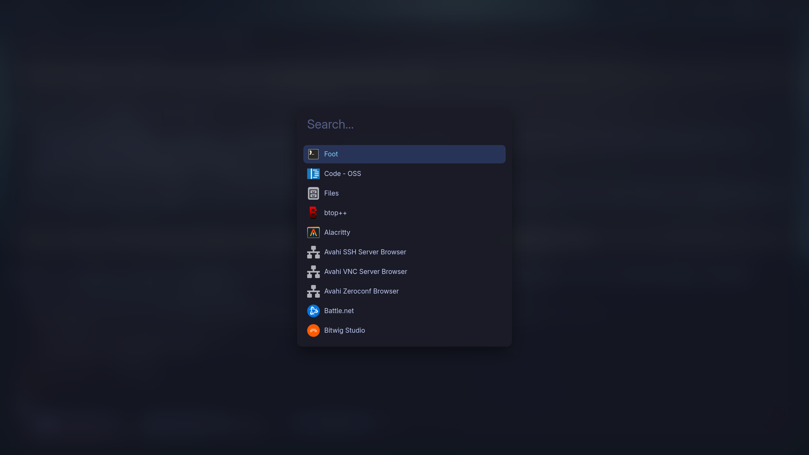

# launchr

A Wayland application launcher in the spirit of [fuzzel](https://codeberg.org/dnkl/fuzzel):
type, fuzzy match, hit Enter. Built on GTK4 + `wlr-layer-shell`.



## What it does

- **Tokyo Night** palette throughout, independent of your GTK theme: the stylesheet is loaded
  above `GTK_STYLE_PROVIDER_PRIORITY_USER`, so a theme in `~/.config/gtk-4.0/gtk.css` cannot
  repaint the list or its selection.
- **Dims the desktop**, and with `-b` blurs it too. No compositor blur rule, no config, nothing
  Hyprland-specific: launchr screenshots the output through `wlr-screencopy-v1`, blurs the
  image in process, and paints it as its own backdrop under the scrim. Works the same on river,
  sway, Hyprland, Wayfire — anything wlroots-based. The screenshot is the single most expensive
  thing the launcher does, so it is only taken when asked for; without `-b`, and on a
  compositor without screencopy, the backdrop is the scrim alone.
- **Large input, small results** — 26px search field above 6 result rows at 14px.
- **No rules, frames or separators** — grouping is done purely with spacing and a single
  rounded highlight on the selected row. Rows show the application name only; the `Comment`
  and `Keywords` are still searched, just not displayed.
- **The panel never moves.** It reserves the height of a full result list, so narrowing a
  query empties rows out from the bottom instead of walking the input up the screen. The input
  starts empty; `-p` puts placeholder text in it.
- **Popularity ranking** — every launch is counted, and the count feeds back into the order.
  With an empty query the list is exactly your most-used applications, most-used first. With a
  query, the count is a log-scaled boost on top of the fuzzy match score, so a frequently used
  app wins ties but cannot bury a much better name match.

## Install a release binary

x86_64 glibc build from the [releases page](https://github.com/Fonsie-lu/launchr/releases/latest):

```bash
V=0.1.0
curl -LO https://github.com/Fonsie-lu/launchr/releases/download/v$V/launchr-$V-x86_64-unknown-linux-gnu.tar.gz
curl -LO https://github.com/Fonsie-lu/launchr/releases/download/v$V/launchr-$V-x86_64-unknown-linux-gnu.tar.gz.sha256
sha256sum -c launchr-$V-x86_64-unknown-linux-gnu.tar.gz.sha256
tar xzf launchr-$V-x86_64-unknown-linux-gnu.tar.gz
install -Dm755 launchr-$V-x86_64-unknown-linux-gnu/launchr ~/.local/bin/launchr
```

The binary is dynamically linked, so GTK4 and `gtk4-layer-shell` still have to be installed —
the runtime libraries only, not the `-dev`/`-devel` packages. On a musl distro, or for anything
other than x86_64, build from source instead.

## Build and install

```bash
./install.sh                        # builds, installs ~/.local/bin/launchr
sudo ./install.sh --prefix /usr/local
./install.sh --uninstall
```

The script checks for `cargo`, `pkg-config`, `gtk4` and `gtk4-layer-shell`, prints the package
names for Arch, Fedora, Debian, openSUSE, Alpine and Void if something is missing, then builds
and installs. It warns when the target directory is not on `PATH` and prints ready-made keybind
lines for river, sway, niri and Hyprland. By hand it is just:

```bash
cargo build --release
install -Dm755 target/release/launchr ~/.local/bin/launchr
```

A keybind is normally run through a bare `/bin/sh`, which reads no shell rc file — so if
`~/.local/bin` is only added to `PATH` by your `.bashrc` or `.zshrc`, write the full path in
the binding.

Bind it to a key however your compositor does that:

```
# river
riverctl map normal Super D spawn launchr

# sway
bindsym $mod+d exec launchr
```

```lua
-- Hyprland (Lua config)
hl.bind({ key = "SUPER, D", dispatcher = hl.dsp.exec_cmd("launchr") })
```

## Usage

```
launchr [options]

-l, --lines N       result rows to show (default 6)
-w, --width N       panel width in pixels (default 680)
-p, --prompt TEXT   placeholder text (default: none)
-q, --query TEXT    start with the input prefilled
-b, --blur [N]      blur the desktop behind the launcher, radius N
                    (default 32, off unless asked for)
-d, --dim F         backdrop dim, 0.0 to 1.0 (default 0.75)
    --no-blur       no blur; the default
-h, --help          show this help
```

Colors, font size, list length, dim, blur and a list of directly launchable AppImages can also
be set in `~/.config/launchr.json` — see [Configuration](#configuration). Flags above override it.

| Key | Action |
| --- | --- |
| type | filter |
| `Down` / `Tab` / `Ctrl+n` / `Ctrl+j` | next result (wraps) |
| `Up` / `Shift+Tab` / `Ctrl+p` / `Ctrl+k` | previous result (wraps) |
| `PageDown` / `PageUp` | move five |
| `Enter` or click | launch and record the hit |
| `Escape` or click outside | dismiss |

If you already have a compositor blur rule for the `launchr` layer namespace, drop it —
the two would stack.

## Configuration

`~/.config/launchr.json` (`$XDG_CONFIG_HOME/launchr.json` if set) is optional and every field in
it is optional. Anything left out keeps its built-in default, and a flag on the command line
overrides whatever the file says.

```json
{
  "colors": {
    "background": "#10111e",
    "panel": "#1a1b26",
    "foreground": "#c0caf5",
    "selection": "#283457",
    "accent": "#7aa2f7",
    "muted": "#565f89"
  },
  "font_size": 21,
  "lines": 6,
  "dim": 0.75,
  "blur": 0,
  "appimages": [
    { "name": "My App", "path": "~/Apps/MyApp.AppImage", "icon": "myapp" }
  ]
}
```

- **`colors`** — hex colors (`#rrggbb`). `background` is the scrim behind the blurred/dimmed
  desktop, `panel` the launcher's own background, `foreground` body text, `selection` the
  highlighted-row and text-selection color, `accent` the input caret and the selected row's
  name, `muted` placeholder text. An invalid or unknown color is ignored (a warning is printed
  to stderr) and that one field falls back to its default rather than failing the whole file.
- **`font_size`** — pixel size of a result row's name; the search entry scales with it so it
  stays proportionally larger.
- **`lines`** — same as `-l`/`--lines`.
- **`dim`** — same as `-d`/`--dim`.
- **`blur`** — same convention as `-b`/`--blur`: `0` (or omitted) is off, any other number is the
  radius in pixels.
- **`appimages`** — entries with no `.desktop` file, launched directly instead of through GIO.
  `path` accepts a leading `~/`. `icon` is an icon *name* looked up in the current icon theme
  (not a file path); omit it to get a generic executable icon. An entry whose `path` doesn't
  resolve to a file, or whose `name` is empty, is skipped with a warning rather than failing the
  whole file. Launch counts for AppImages are tracked the same way as for regular applications.

Malformed JSON, or a file that can't be read at all (other than simply not existing), is
reported on stderr and the launcher falls back to built-in defaults rather than refusing to
start.

## How the backdrop works

Dimming is a scrim over a transparent fullscreen surface and costs nothing measurable. `-b`
adds the blur, and that is what costs: a screenshot means a compositor round trip and a
readback of the entire framebuffer. On this desktop it is the difference between a 39ms and a
58ms first frame; on a laptop it is considerably more, which is why it is opt-in.

The screenshot is taken before the window is mapped, so the launcher is never in its own
snapshot, and the backdrop is a frozen frame for as long as the launcher is open.

Blurring runs on a downscaled copy: the capture is sampled down to a longest edge of 480px,
three separable box passes approximate a Gaussian, and the renderer scales the small texture
back up when it draws. Capture plus blur is around 25ms for a 2560x1440 output. It happens on
a worker thread while GTK starts up, so part of it is free — but only part.

With more than one output, each is captured, and the shot is paired with the monitor the
compositor put the layer surface on by connector name (`DP-1`, `HDMI-A-1`).

## Startup

A launcher is judged on the delay between the keybind and the first frame, so the work is
arranged to overlap rather than queue up. Worker threads start before GTK does — one reads the
desktop files, and with `-b` a second captures and blurs the backdrop over its own Wayland
connection — while the main thread brings the toolkit up. They are joined before the window is
presented, which is the only ordering that has to hold: the screenshot must predate the map.

Three defaults exist purely to keep a process that lives for a few seconds from paying for
things it never uses. Each one gives way to an explicit setting in the environment:

| Default | Why | Override |
| --- | --- | --- |
| `gtk::init`, no `GtkApplication` | `GApplication` registers on the session bus before it will emit `activate` | — |
| `GSK_RENDERER=cairo` | building a GL or Vulkan context costs more than this UI ever spends drawing | set `GSK_RENDERER` |
| `GTK_THEME=Adwaita` | the launcher paints over the user theme anyway, and a big one is a quarter of a megabyte of CSS to parse first | set `GTK_THEME` |

`LAUNCHR_TIMING=1` prints the breakdown to stderr:

```
$ LAUNCHR_TIMING=1 launchr -b
launchr:     0.0ms  main
launchr:    15.2ms  gtk init
launchr:    48.6ms  captured
launchr:    63.3ms  blurred
launchr:    71.4ms  css loaded
launchr:    78.0ms  items loaded
launchr:    78.1ms  backdrop collected
launchr:    83.3ms  rows filled
launchr:   118.7ms  first frame
```

The backdrop is collected after the item list is built rather than before, so `AppInfo::all()`
— which reparses every desktop file, and is the most expensive thing left on the main thread —
overlaps the capture instead of queueing behind it. Neither wait is unbounded: every compositor
exchange after the registry is up runs on a 300ms deadline, and the main thread gives the whole
worker 900ms before it settles for a dim-only window.

What is left is nearly all GTK — opening the display, initialising the style cascade and
mapping the surface — so if a machine is slower than this, that is the place to look first.
Numbers above are a 2560x1440 output on a Ryzen 5 5600; without `-b` the same machine reaches
the first frame in about 110ms.

## Where the data lives

`$XDG_DATA_HOME/launchr/usage.tsv` (`~/.local/share/launchr/usage.tsv`), one line per app:

```
count	last_used_unix	desktop_id
```

Delete the file to reset the ranking, or edit it to pin something to the top. Unparsable lines
are skipped rather than fatal, and writes go through a temp file that is flushed to disk before
being renamed into place, so neither an interrupted launch nor a power cut can truncate the
store.

## Layout

| File | Role |
| --- | --- |
| `src/main.rs` | layer-shell window, widget tree, key handling, ranking, `.desktop` scan |
| `src/capture.rs` | `wlr-screencopy-v1` client |
| `src/blur.rs` | downscale + box blur |
| `src/matcher.rs` | fuzzy subsequence scorer |
| `src/usage.rs` | launch-count store |
| `src/config.rs` | `~/.config/launchr.json` loading and validation |
| `src/style.css` | Tokyo Night theme template, compiled into the binary |

Applications come from GIO's `AppInfo::all()`, which handles `NoDisplay`, `OnlyShowIn`, `Exec`
field codes and `Terminal=true` for us. GIO's Rust bindings expose no `GDesktopAppInfo`, so
`Keywords=` and `GenericName=` are read straight from the desktop files in `$XDG_DATA_DIRS`
and folded into the searchable text at a lower weight than the name.

## Tests

```bash
cargo test
```

Covers the scorer's ordering guarantees (prefix over scattered, word start over mid-word,
shorter name on a tie), the blur's flat-image/point-spread/transpose behaviour and its format
handling, and the usage store's round trip and corrupt-line handling.
